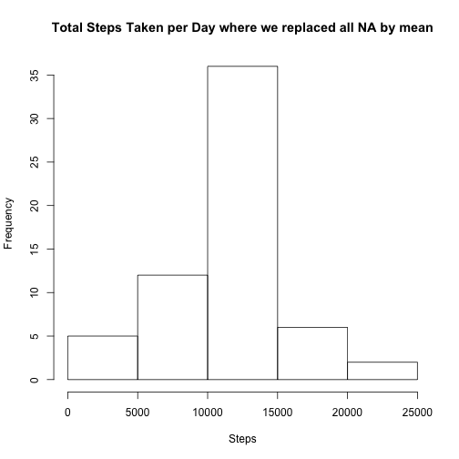

Reproducible Research: Peer Assessment 1
==============================================
This assignment makes use of data from a personal activity monitoring device. This device collects data at 5 minute intervals through out the day. The data consists of two months of data from an anonymous individual collected during the months of October and November, 2012 and include the number of steps taken in 5 minute intervals each day.


Loading and preprocessing the data
===================================
To get your data, download activity.csv file in your working directory together with your .Rmd file.

Then we load data and convert variables types.

```r
sourcedata <- read.csv(file="activity.csv", sep=",", header=TRUE)

sourcedata$steps <- as.numeric(sourcedata$steps)
sourcedata$date <- as.Date(sourcedata$date)
```

Here you can see summary of loaded data

```r
summary (sourcedata)
```

```
##      steps            date               interval   
##  Min.   :  0.0   Min.   :2012-10-01   Min.   :   0  
##  1st Qu.:  0.0   1st Qu.:2012-10-16   1st Qu.: 589  
##  Median :  0.0   Median :2012-10-31   Median :1178  
##  Mean   : 37.4   Mean   :2012-10-31   Mean   :1178  
##  3rd Qu.: 12.0   3rd Qu.:2012-11-15   3rd Qu.:1766  
##  Max.   :806.0   Max.   :2012-11-30   Max.   :2355  
##  NA's   :2304
```


## What is mean total number of steps taken per day?

To answer on this question, we need proceed two steps:

1. Make a histogram of the total number of steps taken each day

2. Calculate and report the mean and median total number of steps taken per day

To build a histogram, we need to monitor the dataset. To calculate total number of steps per day, we use aggregate(). I am also going to ignore an NA values.


```r
meanStepData <- aggregate(steps~date, data=sourcedata, FUN=sum, na.rm=TRUE)
hist(meanStepData$steps, main="Total Steps Taken per Day", xlab="Steps")
```

 

At the histogram, you can see that on folowwing date a person makes 10.000 - 15.000 mostly.

Next we will calculate the mean and median total number of steps taken per day


```r
mean(meanStepData$steps)
```

```
## [1] 10766
```

```r
median(meanStepData$steps)
```

```
## [1] 10765
```

```r
summary(meanStepData$steps, na.rm=TRUE, digits = 10)
```

```
##    Min. 1st Qu.  Median    Mean 3rd Qu.    Max. 
##      41    8841   10765   10766   13294   21194
```

Mean  total number of steps taken each da is 10766, median - 10765.

## What is the average daily activity pattern?
To answer on this question, we need proceed two steps:

1. Make a time series plot (i.e. type = "l") of the 5-minute interval (x-axis) and the average number of steps taken, averaged across all days (y-axis)

2. Which 5-minute interval, on average across all the days in the dataset, contains the maximum number of steps?

Now we ned to get relation between steps and interval. As we have already do, we we use aggregate() funcationa and ignore an NA values.


```r
avgStepsPerInterval <- aggregate(steps~interval, data=sourcedata, FUN=mean, na.rm=TRUE)
plot(avgStepsPerInterval$interval, avgStepsPerInterval$steps, type="l", 
     main="The average number of steps \n taken in 5-minutes interval across all days",
     xlab="Interval", ylab="Average number of steps")
```

 

On average across all the days in the dataset, the maximum number of steps contains interval 835 (206 steps).


```r
which.max(avgStepsPerInterval$steps)
```

```
## [1] 104
```

```r
avgStepsPerInterval[104,]
```

```
##     interval steps
## 104      835 206.2
```


## Imputing missing values
With our initial look at the data in our summary table it is clear there are a large number of "NA" values in the data. Around of 13% of intervals is missing number of steps.


```r
countNA <- sum(is.na(sourcedata$steps))
percentNA <- countNA/nrow(sourcedata)*100
```

To solve this problem, we fireplaced all missing values with averages over the same interval across all days in data. One way to do that is as follows:

```r
sourcedataNAmean <- sourcedata
sourcedataNAmean$steps[is.na(sourcedataNAmean$steps)] <- mean(sourcedata$steps, na.rm=TRUE)
```

Below you can see a histogram showing the total number of steps taken each day for the new dataset


```r
meanStepDataNA <- aggregate(steps~date, data=sourcedataNAmean, FUN=sum, na.rm=TRUE)
hist(meanStepDataNA$steps, main="Total Steps Taken per Day where we replaced all NA by mean", xlab="Steps")
```

 

Also, we need to review summary of the new dataset to be sure that our replacement did not change our data source drammatically.


```r
mean(meanStepDataNA$steps)
```

```
## [1] 10766
```

```r
median(meanStepDataNA$steps)
```

```
## [1] 10766
```

```r
summary(meanStepDataNA$steps, na.rm=TRUE, digits=10)
```

```
##    Min. 1st Qu.  Median    Mean 3rd Qu.    Max. 
##      41    9819   10766   10766   12811   21194
```

Comparing two histograms, it's immediate to see, that data become more peaked around center of distribution. Mean number of steps according to the new data is 10766, while median become equal to mean. The result is expected since we fill our missing data with averages, bringing distribution closer to its mean.

## Are there differences in activity patterns between weekdays and weekends?

Firsly, we create a new factor variable in the dataset with two levels ??? ???weekday??? and ???weekend??? indicating whether a given date is a weekday or weekend day.


```r
sourcedataNAmean$weekday <- factor(weekdays(sourcedataNAmean$date)=="Sunday" | 
                            weekdays(sourcedataNAmean$date)=="Saturday", 
                            labels=c("weekday", "weekend"))
head(sourcedataNAmean)
```

```
##   steps       date interval weekday
## 1 37.38 2012-10-01        0 weekday
## 2 37.38 2012-10-01        5 weekday
## 3 37.38 2012-10-01       10 weekday
## 4 37.38 2012-10-01       15 weekday
## 5 37.38 2012-10-01       20 weekday
## 6 37.38 2012-10-01       25 weekday
```

```r
summary(sourcedataNAmean)
```

```
##      steps            date               interval       weekday     
##  Min.   :  0.0   Min.   :2012-10-01   Min.   :   0   weekday:12960  
##  1st Qu.:  0.0   1st Qu.:2012-10-16   1st Qu.: 589   weekend: 4608  
##  Median :  0.0   Median :2012-10-31   Median :1178                  
##  Mean   : 37.4   Mean   :2012-10-31   Mean   :1178                  
##  3rd Qu.: 37.4   3rd Qu.:2012-11-15   3rd Qu.:1766                  
##  Max.   :806.0   Max.   :2012-11-30   Max.   :2355
```

Then we make plot to compare activity during weekday and weekend separatedly.

```r
library(ggplot2) 

avgStepsPerWeekDay <- aggregate(steps ~ interval + weekday, data = sourcedataNAmean, 
                                FUN = mean)

g <- ggplot (data=avgStepsPerWeekDay, aes (interval, steps)) +
  geom_line(color = "black", size = 0.5) + facet_wrap(~weekday, ncol = 1)+
  theme_bw() +
  theme(strip.background = element_rect(fill = "beige")) +
  ggtitle ("The average number of steps taken in 5-minutes interval across all days \n for weekday and weekend\n")

print (g)
```

 

At this plot, we can see that working days activity is higher that during weekends.
